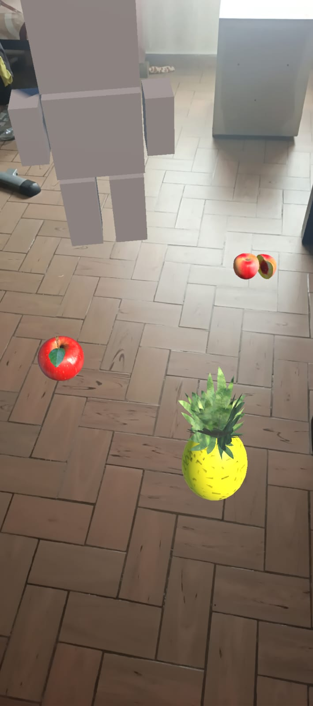
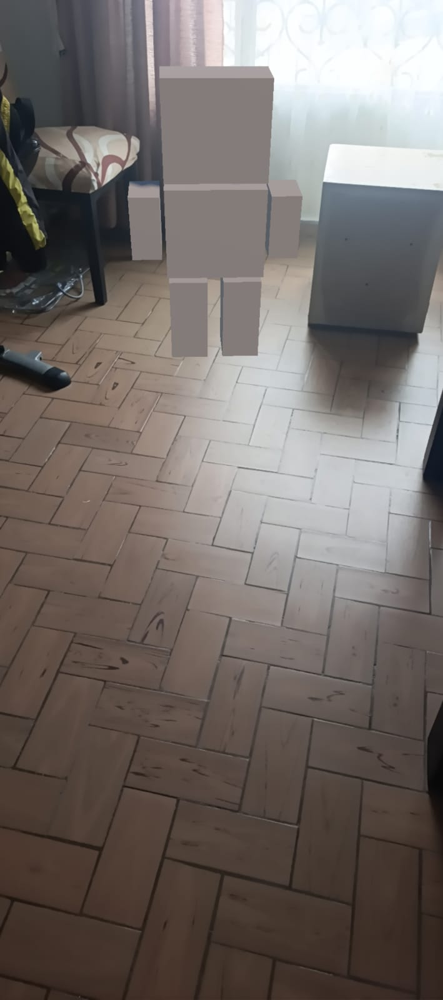
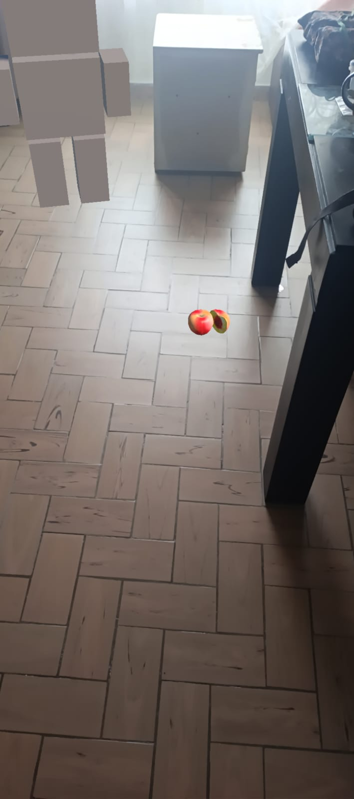
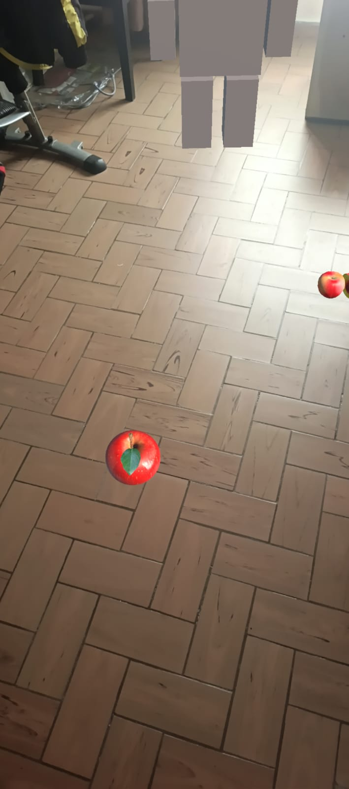
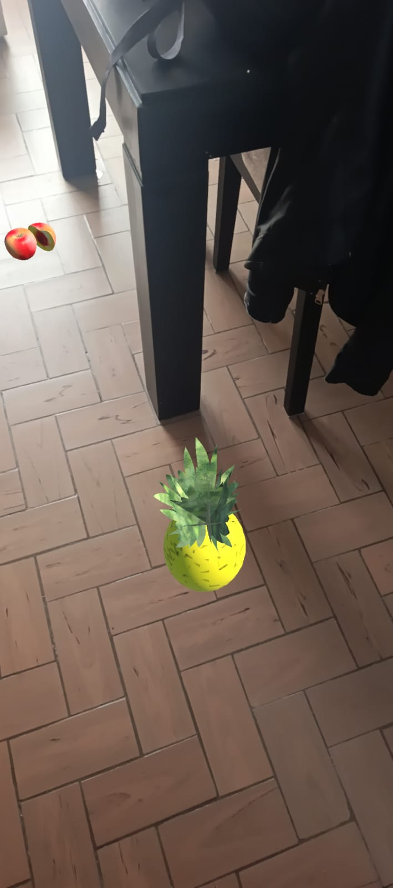

# 📱 AUGMENTED REALITY

Proyecto de **Realidad Aumentada** desarrollado con **Unity y C#**, diseñado para integrar objetos 3D dentro de un entorno real utilizando la cámara de un dispositivo móvil.

El proyecto explora la integración entre un entorno físico y elementos digitales, permitiendo visualizar e interactuar con objetos virtuales dentro del espacio real.

---

## 🎥 Gameplay

[▶️ Ver demostración en YouTube](https://youtube.com/shorts/HfkBbKTAUrg)

---

## 🛠️ Tecnologías

- Unity
- C#
- AR
- 3D
- Mobile
- Cámara
- Git / GitHub

---

## ✨ Características

- Realidad Aumentada.
- Detección del entorno real.
- Integración de objetos 3D.
- Uso de la cámara del dispositivo.
- Colocación de elementos virtuales.
- Interacción con objetos 3D.
- Experiencia orientada a dispositivos móviles.

---

## 🎮 Mecánica principal

El proyecto utiliza la cámara del dispositivo para visualizar un entorno real y añadir diferentes elementos virtuales.

El usuario puede:

1. Utilizar la cámara del dispositivo.
2. Detectar una superficie del entorno.
3. Colocar objetos virtuales.
4. Visualizar los objetos 3D integrados con el espacio real.
5. Interactuar con la experiencia de Realidad Aumentada.

---

## 📸 Capturas del proyecto

### Entorno real

### Objeto 3D

### Integración con el entorno

### Experiencia AR

### Gameplay

---

## 🎯 Objetivo del proyecto

El objetivo de este proyecto fue experimentar con tecnologías de **Realidad Aumentada** y comprender cómo integrar contenido digital dentro de un entorno físico.

El proyecto permitió aplicar conocimientos de desarrollo 3D, programación y experiencias interactivas orientadas a dispositivos móviles.

---

## 💻 Programación y sistemas desarrollados

Durante el desarrollo trabajé principalmente en:

- Configuración del proyecto de Realidad Aumentada.
- Integración de objetos 3D.
- Detección de superficies.
- Colocación de objetos virtuales.
- Interacción con elementos 3D.
- Uso de la cámara del dispositivo.
- Desarrollo de experiencias interactivas para dispositivos móviles.

---

## 📚 Aprendizajes

Este proyecto me permitió reforzar conocimientos sobre:

- Desarrollo en Unity.
- Programación en C#.
- Desarrollo 3D.
- Realidad Aumentada.
- Interacción con objetos.
- Desarrollo para dispositivos móviles.
- Integración entre entornos reales y virtuales.
- Organización de proyectos con Git y GitHub.

---

## 👨‍💻 Autor

**Andrés Yesid Niño Galvis**

Game Developer en formación.

### Tecnologías principales

**Unity · C# · AR · 3D · Mobile**

---

## 🌐 Portafolio

Puedes conocer más sobre mis proyectos en:

**https://andresnino12.github.io**
